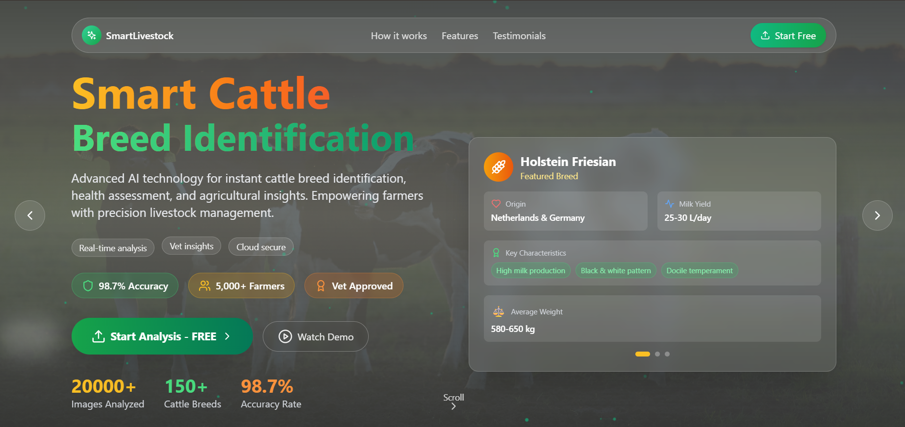

# Cattle Breed Classifier

[](https://python.org)
[](https://pytorch.org)
[](https://fastapi.tiangolo.com)
[](https://react.dev)
[](https://www.typescriptlang.org)
[](https://vitejs.dev)
[](https://tailwindcss.com)

Web application and REST API for identifying Indian bovine breeds from images using a PyTorch ResNet-18 model trained on 41 indigenous cattle and buffalo breeds.



## Features

- 🧬 **41 Indian Bovine Breeds**: Accurate classification across indigenous cattle and buffalo breeds with top-3 confidence breakdown
- ⚡ **PyTorch ResNet-18 Neural Network**: Deep learning backbone featuring custom sequential classifier layers for high-precision inference
- 🎨 **Interactive React Frontend**: Responsive glassmorphic interface with drag-and-drop upload, live preview, and instant results
- 🚀 **FastAPI Backend Server**: Asynchronous REST API delivering real-time predictions and optional single-port static app hosting
- 📊 **Agricultural & Breed Insights**: Detailed breed profiles including species classification, physical traits, care notes, and estimated milk yield

## Project Structure

```text
Breed/
├── best_cattle_breed_model.pth    # Trained PyTorch model checkpoint
├── final_cattle_breed_model.pth   # Final training checkpoint
├── class_names.json               # List of 41 breed classes
├── docs/
│   └── screenshot.png             # UI preview image
├── project/
│   ├── index.html
│   ├── package.json
│   ├── vite.config.ts
│   ├── .env.example
│   ├── src/                       # React frontend source
│   │   ├── components/            # UI components (Landing, Results, UploadZone)
│   │   ├── services/              # API client & services
│   │   └── App.tsx
│   └── server/                    # Backend
│       ├── app.py                 # FastAPI service & PyTorch pipeline
│       ├── default_api.py         # Breed info lookup
│       └── requirements.txt       # Python dependencies
└── README.md
```

## Environment Setup

The application uses environment variables for Google Gemini enrichment and API routing.

1. Navigate to the frontend directory:
```bash
cd project
```

2. Create your local `.env.local` file from the example template:
```bash
# Linux / macOS
cp .env.example .env.local

# Windows (PowerShell)
Copy-Item .env.example .env.local
```

3. Add your Gemini API key in `project/.env.local`:
```env
# Get a free key from https://aistudio.google.com/
VITE_GEMINI_API_KEY=your_actual_gemini_api_key

# Backend classification endpoint (defaults to local FastAPI server)
VITE_CLASSIFIER_API=http://127.0.0.1:8000
```

All `.env` and `.env.local` files are excluded in `.gitignore` to ensure private keys are never committed.

## Getting Started

### Prerequisites

- Python 3.10+
- Node.js 18+ and npm

### 1. Backend Setup

```bash
cd project/server
python -m venv .venv

# Windows
.\.venv\Scripts\Activate.ps1

# Linux / macOS
source .venv/bin/activate

pip install -r requirements.txt
python -m uvicorn app:app --host 0.0.0.0 --port 8000
```

The backend runs at `http://localhost:8000`.
- Health check: `http://localhost:8000/health`
- Swagger documentation: `http://localhost:8000/docs`

### 2. Frontend Setup

In a separate terminal:

```bash
cd project
cp .env.example .env.local
npm install
npm run dev
```

The Vite dev server runs at `http://localhost:5173` (or `http://localhost:5174`).

### 3. Single Port Production Run

To serve the frontend directly through FastAPI:

```bash
cd project
npm run build
cd server
python -m uvicorn app:app --host 0.0.0.0 --port 8000
```

Visit `http://localhost:8000` to access the full application.

## API Endpoints

### POST /classify

Accepts an image file and returns predicted breed, confidence score, and top-3 probabilities.

**Request:**
- Content-Type: `multipart/form-data`
- Parameter: `file` (image)

**Response:**
```json
{
  "breed": "Sahiwal",
  "confidence": 99.99,
  "top3": [
    { "label": "Sahiwal", "confidence": 99.99 },
    { "label": "Nagpuri", "confidence": 0.01 },
    { "label": "Hariana", "confidence": 0.0 }
  ],
  "species": "Bos indicus",
  "origin": "Punjab / Pakistan border",
  "traits": ["High milk yield", "Heat resistant", "Reddish-brown coat"],
  "description": "Sahiwal is an indigenous dairy cattle breed..."
}
```

### GET /health

Returns model and API health status.

```json
{
  "status": "ok",
  "model": "best_cattle_breed_model.pth"
}
```

## Model Details

- Architecture: ResNet-18 backbone
- Classification Head: Linear(512 -> 512) -> ReLU -> Dropout(0.2) -> Linear(512 -> 41)
- Input Resolution: 224x224 (resized to 256 then center-cropped)
- Classes: 41 breeds including Sahiwal, Gir, Red Sindhi, Murrah, Jaffarabadi, Nagpuri, Hariana, Kankrej, Ongole, Tharparkar, and others.

## License

MIT
